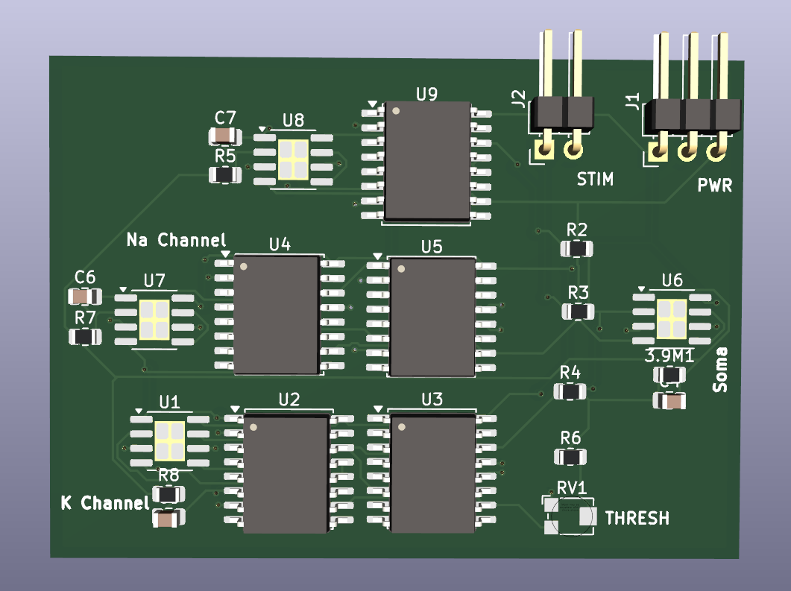

# Analog Hardware Simulation of the Hodgkin-Huxley Neuron Model

## 1. Project Overview and Purpose
This repository contains the design, simulation, and manufacturing files for an analog computational hardware that physically models the Hodgkin-Huxley (HH) biological neuron. The primary objective is to transition neuro-biophysical concepts from theoretical mathematics into a tangible engineering prototype.

Instead of utilizing microprocessors or algorithmic software to approximate the differential equations, this circuit solves the time and voltage-dependent variables ($V, m, h, n$) in real-time using the inherent physical properties of electrons, capacitors, and non-linear analog multipliers. 

## 2. Biological Reference and Parameter Extraction
The electronic component values in this design are strictly derived from the morphological data of a real biological cell, utilizing foundational physics principles rather than hypothetical values.

* **Reference Neuron:** 1-10-8 (Rat, Neocortex)
* **Soma Surface Area:** 1147.99 µm² ($A \approx 1.15 \times 10^{-5}\ cm^{2}$)
* **Data Source:** NeuroMorpho Database

By multiplying the universal specific membrane capacitance ($1\ \mu F / cm^{2}$) and specific channel conductances by the actual surface area of the 1-10-8 neuron, the following hardware parameters were calculated and implemented in the circuit:
* **Soma Membrane Capacitance:** $\approx 11.5\ pF$
* **Sodium (Na) Channel Resistance:** $\approx 724\ k\Omega$
* **Potassium (K) Channel Resistance:** $\approx 2.41\ M\Omega$

## 3. Hardware Architecture
The system is designed on a 2-layer Printed Circuit Board (PCB) using KiCad, featuring an unbroken ground plane on the bottom layer to ensure signal integrity for the analog pathways. Trace widths are constrained to 0.25 mm with 0.20 mm clearances to accommodate the dense IC placement.

The architecture is divided into three core functional blocks:
* **Soma:** Represented by the central capacitor. The accumulation and discharge of charge on this component physically represent the resting potential and action potentials (spikes).
* **Voltage-Controlled Channels:** Built using TL072 operational amplifiers (acting as integrators for gating variables) and MPY634 precision analog multipliers. The multipliers physically execute the non-linear conductance equations (e.g., $m^3h$ for Na and $n^4$ for K).
* **Stimulus (STIM) and Threshold (THRESH):** External input ports for injecting nanoampere-level synaptic currents and a leakage resistor network to maintain the resting potential at approximately -65 mV.

## 4. Simulation and Ground Truth
Prior to hardware manufacturing, the extracted parameters were simulated in two distinct environments to verify the mathematical model against the electronic implementation.

### Mathematical Ground Truth (Python/SciPy)
The standard HH differential equations were solved using numerical integration to establish the baseline biological response. Under a 0.2 nA stimulus, the mathematical model exhibits precise spiking behavior.

### Analog Circuit Simulation (LTspice)
The physical hardware schematic was simulated in LTspice. The resulting transient analysis waveforms confirm that the analog components successfully replicate the action potentials, matching the mathematical ground truth and proving the viability of the physical circuit.

## 5. Repository Structure
* `/hardware`: Contains KiCad PCB design files and LTspice simulation models.
* `/simulation`: Contains the Python script (`hh_model.py`) for the numerical ground truth.
* `/images`: Renderings and plots used in this documentation.
* `1-10-8_Neuromorpho.md`: Detailed mathematical proofs and parameter conversion calculations.
